# pastebin

Pastebin is a service where you can store any text for easy exchange. The service stores notes in the Minio S3 storage. Users can view other users notes without registration.

## Stack
- Java 17
- Maven
- Spring
- JWT
- Liquibase
- Mapstruct
- Lombok
- Swagger
- Mockito
- GitHub Actions
- Docker
- Minio
- Jenkins
- PostreSQL

# API

## Authorization

### `POST` /auth

Authenticates user and returns authorization token

**Request body:**
- `username` - username
- `password` - user password

**Example:**

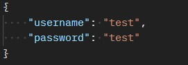

**Response body:**
- `token` - authorization token

**Example:**

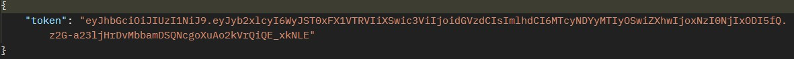

**Exception:**
- using an invalid username or password - `Некорректный логин или пароль`

### `POST` /register

Creates new user

**Request body:**
- `username` - username
- `password` - user password
- `confirmPassword` - password confirmation
- `email` - user email

**Example:**

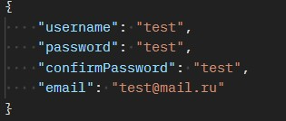

**Response body:**
- `username` - username
- `password` - user password
- `email` - user email
- `notes` - user notes

**Example:**

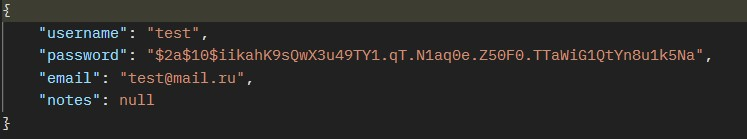

**Exception:**
- using an existing username - `Пользователь 'username' уже существует`
- using the inalid password to confirm - `Пароли не совпадают`
- using an existing email - `Указанная электронная почта уже занята`

##  Note

### `GET` /user/{userId}/notes

**Response body:**
- returns all notes user with id `{userId}`

**Example:**

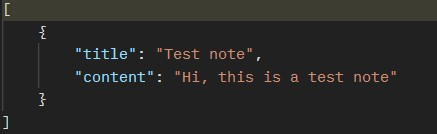

**Exception:**
- using `{userId}` of user who doesn't exist - `Пользователь не найден`
- using `{userId}` of user who doesn't have notes - `Записи не найдены`

### `GET` /user/{userId}/note/{noteId}

**Response body:**
- returns notes with id `{noteId}` user with id `{userId}`

**Example:**

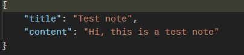

**Exception:**
- using `{userId}` of user who doesn't exist - `Пользователь не найден`
- using `{noteId}` of note that doesn't exist - `Запись не найдена`

### `POST` /user/{userId}/note/new

Creates new note for user with id `{userId}`

**Request body:**
- `title` - title of note
- `content` - content the note

**Example:**

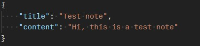

**Response body:**
- `title` - title of note
- `content` - content the note

**Example:**

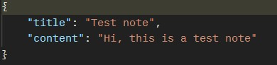

**Exception:**
- using an invalid token - 401 Unauthorized
- using someone else's token - 403 Forbbiden
- using an existing note title - `Статья с таким названием уже существует`

### `PUT` /user/{userId}/note/{noteId}

Changes the content and title of the note with id `{noteId}` user with id `{userId}`

**Request body:**
- `title` - title of note
- `content` - content the note

**Example:**

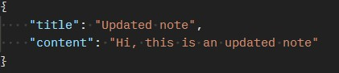

**Response body:**
- `title` - title of note
- `content` - title of note

**Example:**

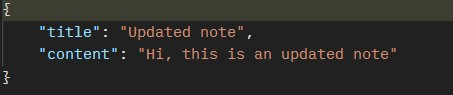

**Exception:**
- using an invalid token - 401 Unauthorized
- using someone else's token - 403 Forbbiden
- using `{noteId}` of note that doesn't exist - `Запись не найдена`
- using an existing note title - `Статья с таким названием уже существует`

### `DELETE` /user/{userId}/note/{noteId}

Delete note with id `{noteId}` user with id `{userId}`

**Exception:**
- using an invalid token - 401 Unauthorized
- using someone else's token - 403 Forbbiden
- using `{noteId}` of note that doesn't exist - `Запись не найдена`

## User

### `GET` /user/{userId}

Return user with id `{userId}`

**Response body:**
- `id` - user id
- `username` - username
- `password` - user password
- `email` - user email
- `notes` - user notes

**Example:**

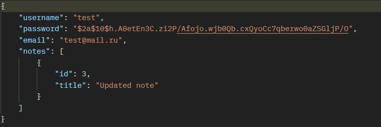

**Exception:**
- using `{userId}` of user who doesn't exist - `Пользователь не найден`

### `PUT` /user/{userId}/update

Update user with id `{userId}`

**Response body:**
- `username` - username
- `password` - user password
- `confirmPassword` - password confirmation
- `email` - user email

**Example:**

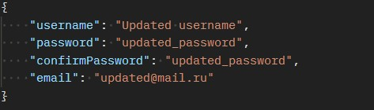

**Response body:**
- `username` - username
- `password` - user password
- `email` - user email
- `notes` - user notes

**Example:**

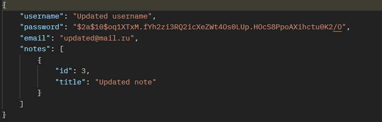

**Exception:**
- using an invalid token - 401 Unauthorized
- using someone else's token - 403 Forbbiden
- using an existing username - `Пользователь 'username' уже существует`
- using the inalid password to confirm - `Пароли не совпадают`
- using an existing email - `Указанная электронная почта уже занята`

### `DELETE` /user/{userId}/delete

Delete user with id `{userId}`

**Exception:**
- using an invalid token - 401 Unauthorized
- using someone else's token - 403 Forbbiden